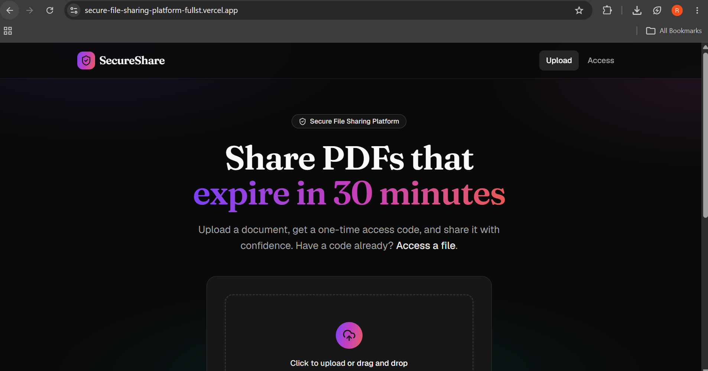
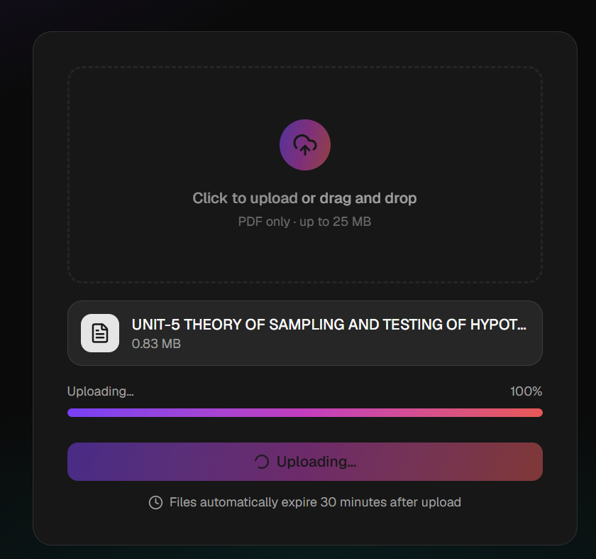
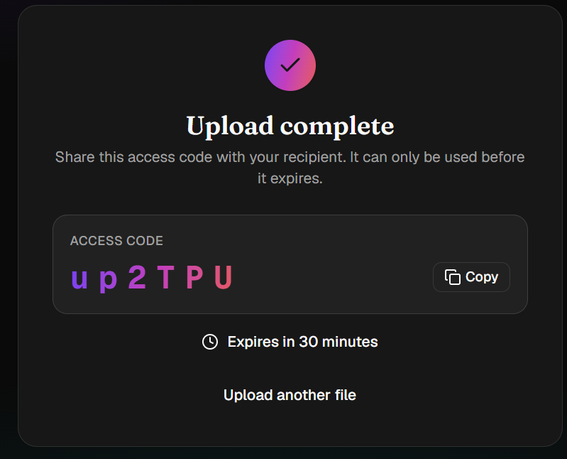
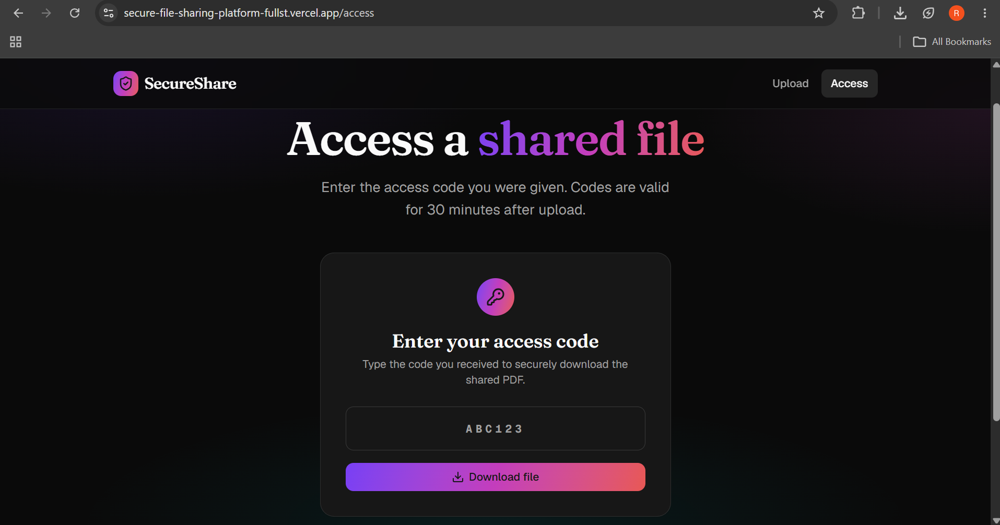
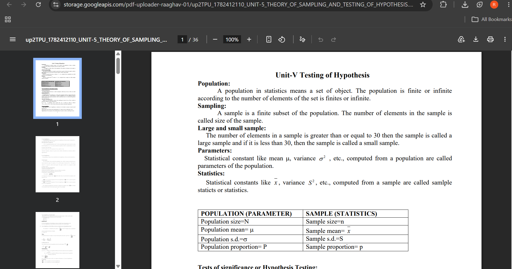

\# 🚀 SecureShare


A secure cloud-based file sharing platform that allows users to upload files and share them using temporary access codes. Files are automatically deleted after the configured expiration time, ensuring privacy and secure sharing.


\## 🌐 Live Demo


\*\*Frontend:\*\* https://secure-file-sharing-platform-fullst.vercel.app


\*\*Backend API:\*\* https://secure-file-sharing-api-96p6.onrender.com


\---

## 📸 Screenshots

### Home Page



---

### Upload File



---

### Access Code Generated



---

### Access Page



---

### Downloaded File




\## ✨ Features


\* 📤 Upload files securely

\* 🔑 Generate unique 6-character access codes

\* ☁️ Store files in Google Cloud Storage

\* ⏳ Automatic file expiration (30 minutes)

\* 🔒 Signed URLs for secure downloads

\* 🌍 Fully deployed cloud application

\* 📱 Responsive user interface


\---


\## 🛠 Tech Stack


\### Frontend


\* Next.js

\* TypeScript

\* Tailwind CSS


\### Backend


\* FastAPI

\* Python

\* REST API


\### Cloud


\* Google Cloud Storage

\* Render

\* Vercel


\---


\## 📂 Project Structure


```

secure-file-sharing-platform-fullstack/

│

├── backend/

│   ├── app/

│   ├── requirements.txt

│   └── ...

│

├── frontend/

│   ├── app/

│   ├── components/

│   ├── package.json

│   └── ...

│

└── README.md

```


\---


\## ⚙️ Local Setup


\### Backend


```bash

cd backend

pip install -r requirements.txt

uvicorn app.main:app --reload

```


\### Frontend


```bash

cd frontend

npm install

npm run dev

```


\---


\## 🔐 Environment Variables


\### Backend


```

GCS\_BUCKET

GCS\_CREDENTIALS\_JSON

```


\### Frontend


```

NEXT\_PUBLIC\_API\_BASE\_URL

```


\---


\## 🚀 Future Improvements


\* Password-protected file sharing

\* Drag-and-drop uploads

\* Download analytics

\* QR code sharing

\* Multiple file uploads

\* Support of other file types

\* File previews


\---


\## 👨‍💻 Author


\*\*Raaghav Baskaran\*\*


If you found this project interesting, feel free to star the repository.


